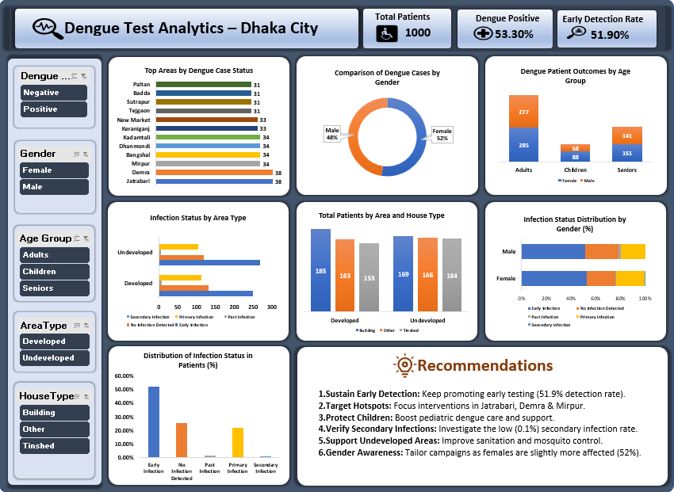

# Dengue Surveillance Dashboard: Data-Driven Insights from Dhaka City

- Developed an interactive data visualization dashboard analyzing Dengue test data from Dhaka City, highlighting infection trends by gender, age, area type, and house type using slicers and dynamic charts.
- Identified high-risk areas and demographic groups through in-depth analysis of infection status, patient outcomes, and distribution patterns to support data-driven public health strategies.
- Designed and implemented multiple slicers and filters (dengue status, gender, age groups, area types) for enhanced user-driven exploration, improving accessibility and decision-making efficiency.

